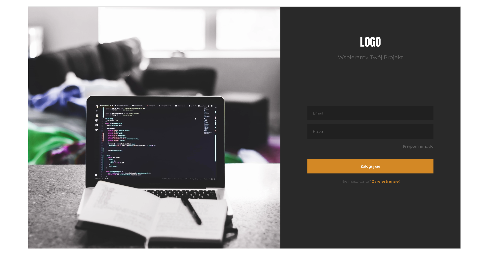
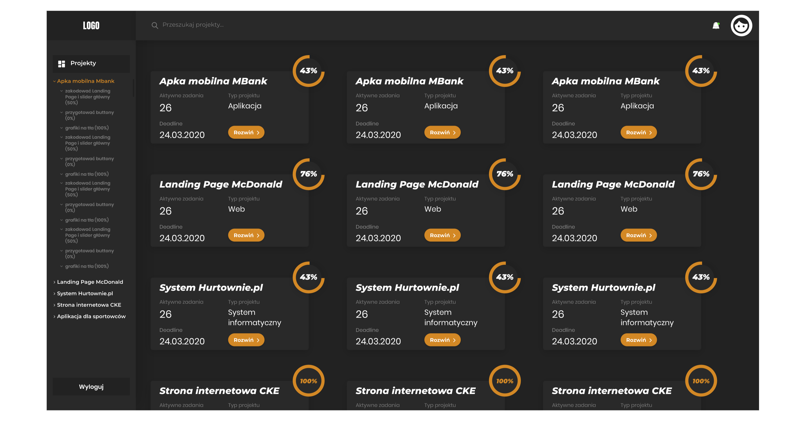
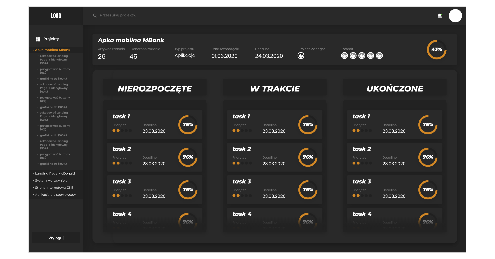

# Project Management - Client

## Table of contents

- [General info](#general-info)

- [Screenshots](#Screenshots)

- [Technologies and libraries](#technologies-and-libraries)

- [Getting Started](#getting-started)

- [Prerequisites](#prerequisites)

- [Installation](#installation)

- [Features](#features)

- [Status](#status)

- [License](#license)

- [Contact](#contact)

## General info

#### [Live demo](#)

Project Management is application created under university science club - "Referencja".

Project Management is an application that will help you manage IT projects. This repository contains a frontend application implementation using React. The project was initialized with `create-react-app`.

- [API github](https://github.com/GoToWinThat/ProjectManagementApi)
- [APP github](https://github.com/RobertJaskolski/ProjectManagementClient)

### Screenshots - Design of application

 

## Technologies and libraries

- react
- redux
- react-router-dom
- axios
- bootstrap
- scss (Styling)
- jest + enzyme (Tests)

## Getting Started

### Prerequisites

- Node
- Yarn

### Installation

1. After cloning or extracting the .zip files of this repository:

   `cd ProjectManagementClient\projectManagmentClient`

2. Install dependencies:

   `yarn` or `yarn install`

3. After installation of dependencies, you must create .env files, I've already created sample file in the repository, you need to rename them and provide your environment variables:

   `.envClient` to `.env`

4. Start the project:

   `yarn start`

## Features

Section in progress

## Status

Project is in progress. We are curently working on our first version of server side. Currently brake due to other university

## License

Distributed under the MIT License.

## Contact

Created by:

- [@mazela](https://www.linkedin.com/in/artur-mazela-203568146/)

- [@lubera](https://www.linkedin.com/in/konrad-lubera-859247207/)

- [@kajstura](https://www.linkedin.com/in/wojciech-kajstura-b13b701a8/)

- [@sobieszczyk](https://www.linkedin.com/in/piotr-sobieszczyk/)

- [@nawrot](https://www.linkedin.com/in/karol-nawrot-5896601a7/)

- [@jaskolski](https://www.linkedin.com/in/robertjaskolski/)

Feel free to contact us!
